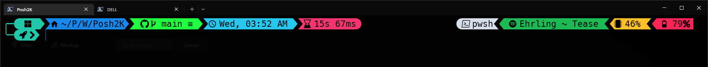

<div align = "center">

<h1><a href="https://2kabhishek.github.io/Posh2K">Posh2K</a></h1>

<a href="https://github.com/2KAbhishek/Posh2K/blob/main/LICENSE">
 </a>

<a href="https://github.com/2KAbhishek/Posh2K/graphs/contributors">
 </a>

<a href="https://github.com/2KAbhishek/Posh2K/stargazers">
</a>

<a href="https://github.com/2KAbhishek/Posh2K/network/members">
 </a>

<a href="https://github.com/2KAbhishek/Posh2K/watchers">
 </a>

<a href="https://github.com/2KAbhishek/Posh2K/pulse">
 </a>

<h3>Short sweet headline with 🎇🎉</h3>

<figure>
  
  <br/>
  <figcaption>Posh2K screenshot</figcaption>
</figure>

</div>

## What is this

Posh2K is a `<utility/tool/feature>` that allows `<insert_target_audience>` to do `<action/task_it_does>`.

## Inspiration

Posh2K was inspired by `<reason/idea>`.

## Prerequisites

Before you begin, ensure you have met the following requirements:

- You have installed the latest version of `<coding_language/dependency/requirement_1>`

## Getting Posh2K

To get Posh2K, follow these steps:

```bash
git clone https://github.com/2kabhishek/Posh2K
cd Posh2K
<install_command>
```

## Using Posh2K

```bash
USAGE:
    command [FLAGS] [OPTIONS]

FLAGS:
    -h, --help              Prints help information.

OPTIONS:
    -o, --option <value>    Option description.
    Options are: a, b. [default: a]

Example:


```

## How it was built

Posh2K was built using `<tech/library>`

## Challenges faced

While building Posh2K the main challenges were `<issue/difficulty>`

## What I learned

While building Posh2K I `<learned/accomplished>` about `<learning/accomplishment>`

## What's next

Planning to add `<feature/module>`.

### To-Do

- [x] Setup repo
- [ ] Think real hard
- [ ] Start typing
- [ ] Change me
- [ ] Update README
- [ ] Finish it

Hit the ⭐ button if you found this useful.

## More Info

<div align="center">

<a href="https://github.com/2KAbhishek/Posh2K">Source</a> | <a href="https://2kabhishek.github.io/Posh2K">Website</a>

</div>
